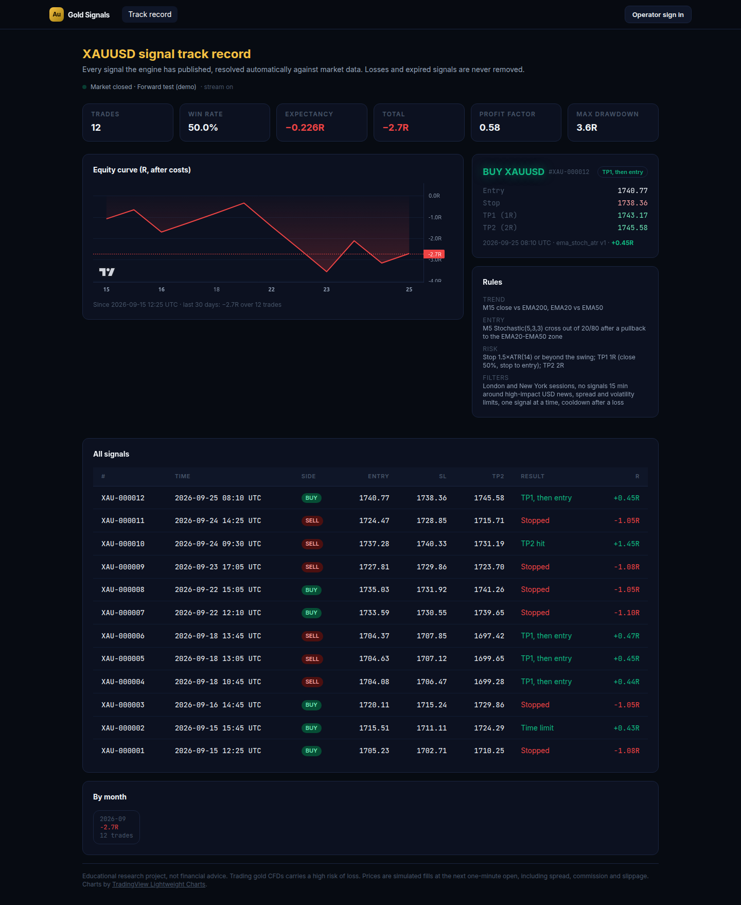
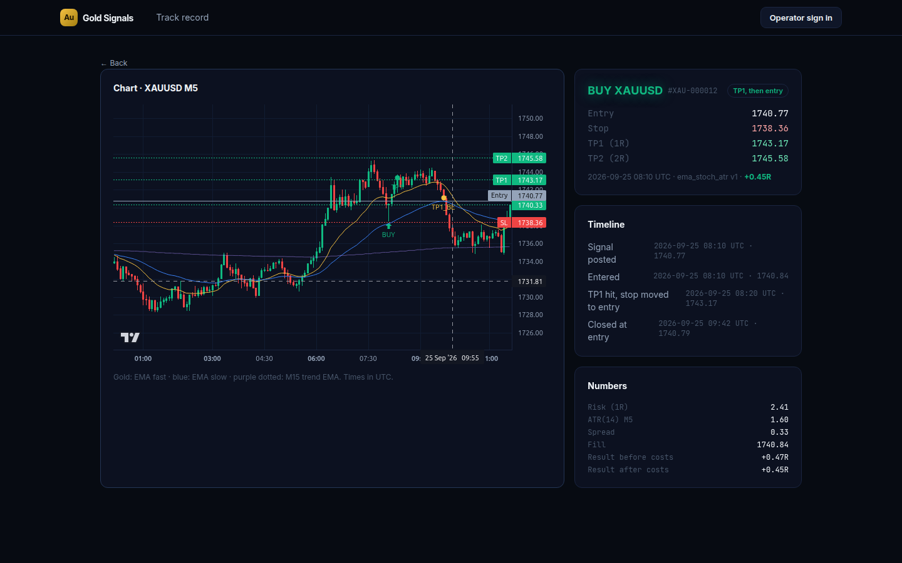
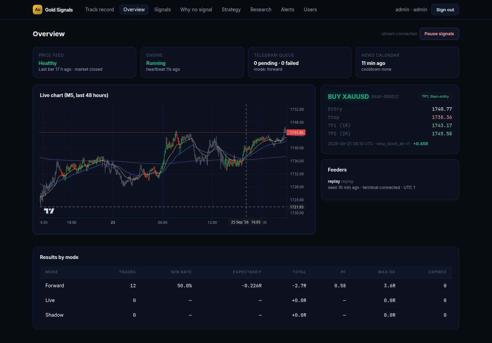

# Gold Signals: an honest XAUUSD signal service

A production-style trading-signal service for gold (XAUUSD). A server-side engine turns MetaTrader 5 price data into trade signals, posts them to Telegram, and tracks every one to its outcome automatically. A public page shows the complete record, losses included. The strategy was backtested with walk-forward validation before anything was published.

> Research and engineering project, not financial advice. See [docs/LEGAL.md](docs/LEGAL.md).



## What it does

- **Rules-based strategy.** It uses the M15 trend (EMA 20/50/200), an M5 pullback plus a Stochastic(5,3,3) cross out of the extreme zone, and ATR/swing stops with 1R and 2R targets. It filters by session (London and New York, DST-aware), news, spread and volatility, allows one signal at a time, and cools down after a loss. Frozen in [docs/STRATEGY_SPEC.md](docs/STRATEGY_SPEC.md).
- **Backtest first.** The Python research package runs a walk-forward test on 7+ years of Dukascopy M1 bid/ask data, with spread, commission and slippage. The parameter grid is pre-registered, 2026 is a locked holdout, Monte Carlo drawdown is reported, and pass/fail gates are fixed before looking. Results: [research/reports/WALKFORWARD.md](research/reports/WALKFORWARD.md).
- **One strategy, two languages, zero drift.** The rules exist in Python for research and TypeScript for the live engine. Shared golden fixtures prove they make the same decision at every M5 close and resolve every signal to the same R.
- **Live engine.** It processes each closed M1 bar in a single Postgres transaction covering signals, events, the "why no signal" log, the Telegram outbox and the cursor. Restarts and outages can't double-post or lose a signal. A single leader runs via an advisory lock.
- **Outcome tracking.** Every signal is resolved on M1 data with conservative intrabar rules: the stop wins ties, TP1 closes half and moves the stop to entry, then TP2. There is also a time exit. Results are in R after costs.
- **Telegram.** Each signal is one message, edited in place as TP1, TP2 or the stop hits, plus a threaded reply. Admin commands: `/pause /resume /stats /health /last /mode`. The admins are alerted if the feed goes silent.
- **Web.** A public track record with an equity curve, every signal, and candlestick charts showing entry, stop and targets (TradingView Lightweight Charts). Operator pages cover health, the "why no signal" log, versioned strategy parameters, research reports, price alerts, users and the audit log. Updates stream over server-sent events.
- **MT5 feeder.** A small Python service on a Windows VPS pushes closed bars and spread over Tailscale with HMAC-signed requests. It detects the broker's UTC offset and uses a local SQLite outbox, so outages lose nothing.

| Signal detail | Operator overview |
|---|---|
|  |  |

## Architecture

```
Windows VPS                                   Linux VPS (Docker Compose)
MT5 terminal ─► feeder (Python) ──HTTPS+HMAC──► Caddy ─► api (Express, SSE) ◄── browsers
               closed M1 bars      Tailscale         │        │ LISTEN/NOTIFY
                                                     │        ▼
                                                  Postgres ◄── engine (strategy, tracker,
                                                               Telegram outbox, watchdog, news)
Laptop: research/ (Python) ── walk-forward report ──► uploaded to the API
```

Details: [docs/DESIGN.md](docs/DESIGN.md). Operations: [docs/RUNBOOK.md](docs/RUNBOOK.md). Roadmap and status: [PLAN.md](PLAN.md).

## Tech

TypeScript (Express 5, Vue 3, Pinia, Tailwind 4, Drizzle ORM, zod, grammY, prom-client, Lightweight Charts) · PostgreSQL 16 · Python (pandas, pyarrow, pytest) · esbuild, Vite, pnpm workspaces · Docker, Caddy, GitHub Actions, GHCR.

## Repository

| Path | What |
|---|---|
| `lib/strategy` | Pure TypeScript strategy, indicators, tracker and stats: the live engine's core |
| `research/` | Python reference implementation, data pipeline, walk-forward, reports |
| `fixtures/golden/` | Shared inputs and expected outputs both languages must reproduce |
| `artifacts/api-server` | API, engine and CLI (bundled into self-contained `dist/*.mjs`) |
| `artifacts/dashboard` | Vue SPA: public track record and `/ops` operator pages |
| `lib/db` | Drizzle schema and SQL migrations |
| `feeder/` | MT5 feeder for Windows, plus a replay tool for demos |
| `deploy/` | Compose stack, Caddyfile, env template |

## Quick start

```bash
pnpm install --frozen-lockfile
pnpm --filter @workspace/strategy test            # strategy + golden parity
pnpm run build                                    # typecheck + build API and dashboard
```

To run the full stack locally with demo data, see [docs/RUNBOOK.md](docs/RUNBOOK.md#local-development). To deploy, see [docs/RUNBOOK.md](docs/RUNBOOK.md#deploy-linux-vps).

## Tests

| Suite | Count | What it proves |
|---|---|---|
| `lib/strategy` (vitest) | 27 | Indicators, tracker edge cases, DST sessions, golden parity with Python |
| `artifacts/api-server` (vitest + Postgres) | 30 | Live engine matches the reference, survives restarts, never double-posts; auth, roles, CSRF, lockout, ingest signing and validation, public/private visibility |
| `research` (pytest) | 29 | Indicators, tracker, sessions and news, v2 breakout rules, golden parity with TypeScript |
| `feeder` (pytest, Linux + Windows) | 10 | UTC offset, closed-bar rule, outage/restart safety, request signing (shared test vector with the API) |

## Status

**Research verdict: the textbook EMA + Stochastic + ATR pullback strategy does not work on gold.** Walk-forward out of sample it loses 0.09R per trade over 1,378 trades (profit factor 0.82), and the 2026 holdout loses 0.19R per trade. A second, pre-registered hypothesis (London-open breakout of the Asian range) came closer but also failed: −0.035R per trade over 611 out-of-sample trades, with a 95% interval spanning zero. The pipeline is built so that a failing strategy is caught before anyone trades it, and both were. Reports: [v1](research/reports/WALKFORWARD.md), [v2](research/reports/WALKFORWARD_LONDON_ORB.md), [research log](research/reports/GRAVEYARD.md).


The software for the gold MVP is built and tested locally. Next are the forward test on a demo account, deployment, and the go/no-go gates in [PLAN.md](PLAN.md). The earlier "SMC Gold Bot" prototype and its evaluation are recorded in PLAN.md §1.
