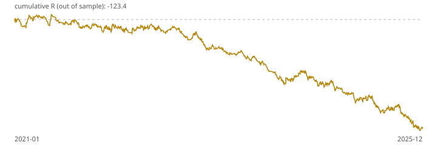

# Walk-forward report: ema_stoch_atr v1

Generated 2026-09-26T21:16:18Z from Dukascopy XAUUSD M1 data, 2019-01-01 to 2026-09-25 (2,742,123 bars). All results are hypothetical and net of spread, commission and slippage unless stated.

## Gate 1 verdict: **FAIL**

| Check | Threshold | Result | Pass |
|---|---|---|---|
| Out-of-sample trades | ≥ 200 | 1378 | yes |
| Profit factor | > 1.3 | 0.82 | no |
| Expectancy (R) | > 0.2 | -0.090 | no |
| Max drawdown (R) | ≤ 15.0 | 130.9 | no |
| Monte Carlo p95 drawdown (R) | ≤ 20.0 | 147.9 | no |
| Holdout expectancy | > 0 | -0.186 (340 trades) | no |

Out-of-sample expectancy 95% bootstrap interval: -0.145 to -0.034 R.

## Walk-forward windows

Train 24 months, test 6 months. Parameters are chosen on the train window only (highest expectancy with at least 60 trades) from the pre-registered grid.

| Test window | Chosen params | Train exp. (R) | Test trades | Test exp. (R) | Test PF |
|---|---|---|---|---|---|
| 2021-01-01 → 2021-07-01 | SL 2.0×ATR, pullback 3, TP1 close 0% | -0.119 | 130 | 0.026 | 1.05 |
| 2021-07-01 → 2022-01-01 | SL 2.0×ATR, pullback 3, TP1 close 0% | -0.086 | 102 | -0.093 | 0.82 |
| 2022-01-01 → 2022-07-01 | SL 2.0×ATR, pullback 3, TP1 close 0% | -0.084 | 147 | -0.043 | 0.91 |
| 2022-07-01 → 2023-01-01 | SL 2.0×ATR, pullback 3, TP1 close 0% | -0.077 | 119 | 0.015 | 1.03 |
| 2023-01-01 → 2023-07-01 | SL 2.0×ATR, pullback 3, TP1 close 0% | -0.022 | 131 | -0.171 | 0.66 |
| 2023-07-01 → 2024-01-01 | SL 2.0×ATR, pullback 5, TP1 close 0% | -0.073 | 87 | -0.167 | 0.69 |
| 2024-01-01 → 2024-07-01 | SL 2.0×ATR, pullback 5, TP1 close 0% | -0.085 | 142 | -0.092 | 0.81 |
| 2024-07-01 → 2025-01-01 | SL 2.0×ATR, pullback 5, TP1 close 50% | -0.091 | 184 | -0.099 | 0.81 |
| 2025-01-01 → 2025-07-01 | SL 2.0×ATR, pullback 5, TP1 close 0% | -0.113 | 154 | -0.160 | 0.69 |
| 2025-07-01 → 2026-01-01 | SL 2.0×ATR, pullback 3, TP1 close 50% | -0.112 | 182 | -0.110 | 0.78 |

## Default parameters, whole period

| Period | Trades | Win rate | Profit factor | Expectancy (R) | Total R | Max DD (R) |
|---|---|---|---|---|---|---|
| All | 2213 | 44.5% | 0.74 | -0.143 | -316.5 | 327.8 |
| 2019 | 103 | 47.6% | 0.76 | -0.127 | -13.0 | 19.4 |
| 2020 | 290 | 41.4% | 0.67 | -0.197 | -57.1 | 60.9 |
| 2021 | 241 | 48.5% | 0.90 | -0.049 | -11.7 | 19.4 |
| 2022 | 280 | 45.7% | 0.80 | -0.109 | -30.6 | 32.3 |
| 2023 | 228 | 44.7% | 0.68 | -0.180 | -41.0 | 42.4 |
| 2024 | 348 | 44.5% | 0.75 | -0.139 | -48.4 | 50.5 |
| 2025 | 357 | 43.4% | 0.68 | -0.184 | -65.5 | 67.6 |
| 2026 | 366 | 43.4% | 0.76 | -0.134 | -49.0 | 58.1 |

## Sensitivity (default parameters, whole period)

| Period | Trades | Win rate | Profit factor | Expectancy (R) | Total R | Max DD (R) |
|---|---|---|---|---|---|---|
| As tested | 2213 | 44.5% | 0.74 | -0.143 | -316.5 | 327.8 |
| No news filter | 2296 | 44.4% | 0.74 | -0.145 | -332.0 | 340.0 |
| No commission or slippage (spread kept) | 2211 | 44.6% | 0.80 | -0.104 | -230.1 | 243.5 |

## Full grid, whole period (in-sample, for context only)

| Period | Trades | Win rate | Profit factor | Expectancy (R) | Total R | Max DD (R) |
|---|---|---|---|---|---|---|
| SL 1.5, PB 3, TP1 50% | 2213 | 44.5% | 0.74 | -0.143 | -316.5 | 327.8 |
| SL 1.5, PB 3, TP1 0% | 2213 | 26.6% | 0.75 | -0.143 | -316.9 | 332.0 |
| SL 1.5, PB 5, TP1 50% | 2216 | 44.5% | 0.74 | -0.144 | -318.2 | 329.4 |
| SL 1.5, PB 5, TP1 0% | 2216 | 26.5% | 0.74 | -0.144 | -319.1 | 334.1 |
| SL 2.0, PB 3, TP1 50% | 2100 | 45.0% | 0.78 | -0.114 | -238.5 | 245.7 |
| SL 2.0, PB 3, TP1 0% | 2100 | 30.7% | 0.79 | -0.108 | -226.0 | 234.5 |
| SL 2.0, PB 5, TP1 50% | 2103 | 45.0% | 0.78 | -0.114 | -240.2 | 247.3 |
| SL 2.0, PB 5, TP1 0% | 2103 | 30.7% | 0.79 | -0.108 | -228.2 | 236.7 |

## Why most M5 bars produce no signal (default parameters)

| Reason | Bars | Share |
|---|---|---|
| session | 211,748 | 38.6% |
| no_cross | 205,918 | 37.5% |
| bias_none | 56,720 | 10.3% |
| one_open | 29,890 | 5.4% |
| news | 15,345 | 2.8% |
| cooldown | 12,336 | 2.2% |
| no_pullback | 5,143 | 0.9% |
| data_gap | 4,007 | 0.7% |
| signal | 2,214 | 0.4% |
| spread | 2,091 | 0.4% |
| warmup | 1,799 | 0.3% |
| friday_cutoff | 1,512 | 0.3% |
| atr_range | 19 | 0.0% |

## Caveats

- Dukascopy prices and spreads differ from any retail broker. The forward test on broker data is the real check.
- The news filter uses a proxy calendar (every 08:30 New York slot, ISM, FOMC), which over-blocks.
- Intrabar order is resolved conservatively on M1 bars: a bar touching stop and target counts as a stop.
- Past performance, simulated or not, does not predict future results. Not financial advice.
