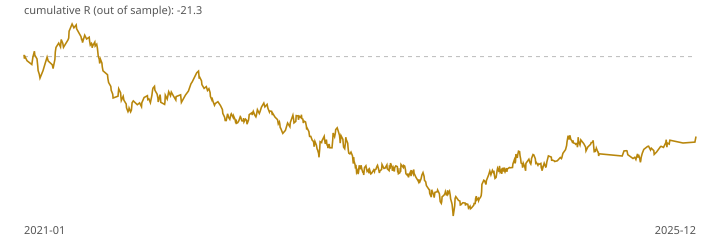

# Walk-forward report: london_orb v1

Generated 2026-09-27T07:50:56Z from Dukascopy XAUUSD M1 data, 2019-01-01 to 2026-09-25 (2,742,123 bars). All results are hypothetical and net of spread, commission and slippage unless stated.

## Gate 1 verdict: **FAIL**

| Check | Threshold | Result | Pass |
|---|---|---|---|
| Out-of-sample trades | ≥ 200 | 611 | yes |
| Profit factor | > 1.3 | 0.92 | no |
| Expectancy (R) | > 0.2 | -0.035 | no |
| Max drawdown (R) | ≤ 15.0 | 51.3 | no |
| Monte Carlo p95 drawdown (R) | ≤ 20.0 | 49.3 | no |
| Holdout expectancy | > 0 | 0.503 (13 trades) | yes |

Out-of-sample expectancy 95% bootstrap interval: -0.110 to 0.041 R.

## Walk-forward windows

Train 24 months, test 6 months. Parameters are chosen on the train window only (highest expectancy with at least 60 trades) from the pre-registered grid.

| Test window | Chosen params | Train exp. (R) | Test trades | Test exp. (R) | Test PF |
|---|---|---|---|---|---|
| 2021-01-01 → 2021-07-01 | stop mid, TP2 3.0R, trend filter on | 0.013 | 45 | 0.092 | 1.17 |
| 2021-07-01 → 2022-01-01 | stop mid, TP2 3.0R, trend filter on | 0.065 | 57 | -0.285 | 0.54 |
| 2022-01-01 → 2022-07-01 | stop mid, TP2 3.0R, trend filter on | 0.005 | 47 | -0.098 | 0.82 |
| 2022-07-01 → 2023-01-01 | stop opposite, TP2 3.0R, trend filter on | -0.050 | 62 | -0.016 | 0.96 |
| 2023-01-01 → 2023-07-01 | stop opposite, TP2 3.0R, trend filter off | -0.055 | 90 | -0.137 | 0.73 |
| 2023-07-01 → 2024-01-01 | stop opposite, TP2 3.0R, trend filter off | -0.091 | 80 | -0.081 | 0.81 |
| 2024-01-01 → 2024-07-01 | stop opposite, TP2 3.0R, trend filter off | -0.042 | 79 | 0.085 | 1.25 |
| 2024-07-01 → 2025-01-01 | stop opposite, TP2 3.0R, trend filter off | -0.033 | 74 | 0.095 | 1.28 |
| 2025-01-01 → 2025-07-01 | stop opposite, TP2 3.0R, trend filter off | -0.016 | 45 | -0.098 | 0.76 |
| 2025-07-01 → 2026-01-01 | stop opposite, TP2 2.0R, trend filter on | 0.015 | 32 | 0.183 | 1.61 |

## Default parameters, whole period

| Period | Trades | Win rate | Profit factor | Expectancy (R) | Total R | Max DD (R) |
|---|---|---|---|---|---|---|
| All | 674 | 48.7% | 0.95 | -0.021 | -14.2 | 46.6 |
| 2019 | 108 | 41.7% | 0.69 | -0.129 | -13.9 | 17.4 |
| 2020 | 84 | 56.0% | 1.37 | 0.132 | 11.1 | 4.9 |
| 2021 | 102 | 41.2% | 0.70 | -0.150 | -15.3 | 23.5 |
| 2022 | 109 | 48.6% | 0.98 | -0.006 | -0.7 | 10.5 |
| 2023 | 107 | 43.9% | 0.69 | -0.154 | -16.5 | 17.5 |
| 2024 | 94 | 55.3% | 1.36 | 0.123 | 11.5 | 6.6 |
| 2025 | 57 | 52.6% | 1.14 | 0.053 | 3.0 | 6.0 |
| 2026 | 13 | 92.3% | 17.32 | 0.503 | 6.5 | 0.4 |

## Sensitivity (default parameters, whole period)

| Period | Trades | Win rate | Profit factor | Expectancy (R) | Total R | Max DD (R) |
|---|---|---|---|---|---|---|
| As tested | 674 | 48.7% | 0.95 | -0.021 | -14.2 | 46.6 |
| No news filter | 674 | 48.7% | 0.95 | -0.021 | -14.2 | 46.6 |
| No commission or slippage (spread kept) | 674 | 48.8% | 0.98 | -0.006 | -4.1 | 41.7 |

## Full grid, whole period (in-sample, for context only)

| Period | Trades | Win rate | Profit factor | Expectancy (R) | Total R | Max DD (R) |
|---|---|---|---|---|---|---|
| stop opposite, TP2 2.0R, trend filter on | 674 | 48.7% | 0.95 | -0.021 | -14.2 | 46.6 |
| stop opposite, TP2 2.0R, trend filter off | 1088 | 47.2% | 0.88 | -0.050 | -54.0 | 75.5 |
| stop opposite, TP2 3.0R, trend filter on | 674 | 48.7% | 0.97 | -0.013 | -8.9 | 43.0 |
| stop opposite, TP2 3.0R, trend filter off | 1088 | 47.2% | 0.90 | -0.043 | -46.7 | 66.7 |
| stop mid, TP2 2.0R, trend filter on | 674 | 48.4% | 0.90 | -0.052 | -35.2 | 62.2 |
| stop mid, TP2 2.0R, trend filter off | 1088 | 47.1% | 0.84 | -0.084 | -91.6 | 102.8 |
| stop mid, TP2 3.0R, trend filter on | 674 | 48.4% | 0.89 | -0.056 | -38.1 | 65.0 |
| stop mid, TP2 3.0R, trend filter off | 1088 | 47.1% | 0.84 | -0.086 | -93.1 | 102.3 |

## Why most M5 bars produce no signal (default parameters)

| Reason | Bars | Share |
|---|---|---|
| signal | 674 | 43.0% |
| range_width | 481 | 30.7% |
| trend | 408 | 26.0% |
| warmup | 6 | 0.4% |

## Caveats

- Dukascopy prices and spreads differ from any retail broker. The forward test on broker data is the real check.
- The news filter uses a proxy calendar (every 08:30 New York slot, ISM, FOMC), which over-blocks.
- Intrabar order is resolved conservatively on M1 bars: a bar touching stop and target counts as a stop.
- Past performance, simulated or not, does not predict future results. Not financial advice.
